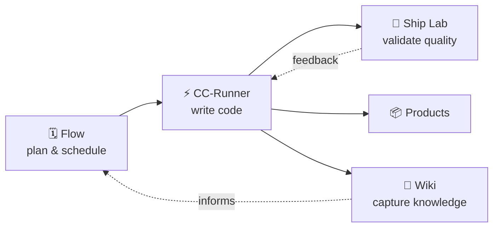

# Julio David Ochoa

TPM in the payment industry — 6+ years in authentication, certification, and card lifecycle. CS from Universidad Simón Bolívar. MIS from Washington University in St. Louis.

By night I build **Factoria**: an AI assembly line where six MCP services and one orchestrator (Claude) turn ideas into shipped products — no human relay between systems.

---

## The Assembly Line

Six services. One orchestrator reads from all of them via MCP, fires Claude Code sessions to write code, captures what it learns to the wiki, and updates the plan. The only mandatory human touchpoint is reviewing the PR.

&nbsp;

### The Services

🗓️ **[Flow](https://github.com/juliodavid8a/flow-app)** · Energy-aware scheduling · 812+ tests · WhatsApp · 18 MCP tools

🧪 **[Ship Lab](https://github.com/juliodavid8a/Ship-Lab)** · 8 AI-powered audit labs · 633+ tests · 22K LOC · 6 MCP tools

⚡ **[CC-Runner](https://github.com/juliodavid8a/cc-runner)** · Spawns Claude Code via MCP · Railway · Hardened · Supabase telemetry

🧠 **[Personal Wiki](https://github.com/juliodavid8a/personal-wiki)** · Knowledge graph + spaced repetition · 113+ nodes · 19 MCP tools

&nbsp;

### The Products

🛒 **[GrocerBot](https://github.com/juliodavid8a/GrocerBot)** · Mom WhatsApps a grocery list in Venezuelan Spanish → bot builds the cart → son pays

📣 **[Megafono](https://github.com/juliodavid8a/Megafono)** · Content OS for X/Twitter · 7 MCP tools · OAuth 1.0a + Auth0

---

## Sparks

Philosophical insights extracted from building — not theory, but patterns that emerged from real failures and real sessions. 26 and counting.

> *"Single source of truth or silent lies"*
> Two sources of truth means one is always a lie. Consolidate, don't synchronize.

> *"Quality gates atrophy under urgency"*
> If the gate depends on someone remembering to check, it will fail when it matters most. Make it structural.

> *"Automate the bridge, elevate the antenna"*
> The human shouldn't ferry data between systems. Automate the mechanical work so the human can operate at the level of ideas.

> *"Speed through precision"*
> Precision is the multiplier. Route cognitive work to the cheapest layer that can handle it.

> *"One-shot materialization"*
> Infrastructure looks like overhead — until it crosses the threshold where ideas materialize in a single session. Then it's the only thing that matters.

---

## Activity

---

> *"I went from being the MCP server to building one."*

More about me

&nbsp;

The "8a" stands for Ochoa.

Born in Venezuela, educated in the US, building for both worlds. GrocerBot exists because my mom sends grocery lists in Venezuelan Spanish on WhatsApp and I got tired of being the relay.

6+ years in payments taught me that protocols matter, failure modes compound, and every system needs an andon cord. The sparks came from applying that thinking to AI collaboration.

The factory thesis: 37 Claude Code sessions and ~$30 in API credits built the infrastructure. Now each new app is 3–4 sessions and ~$4. The methodology compounds — every session makes the next one cheaper.

Powered by espressos and the belief that I haven't yet lived up to what I can do.

# Julio David Ochoa

**$30 built the factory. ~$4 ships each app after that.**

TPM in the payment industry — 6+ years in authentication, certification, and card lifecycle. CS from Universidad Simón Bolívar. MIS from Washington University in St. Louis.

By night I build **Factoria**: an AI assembly line where six MCP services and one orchestrator (Claude) turn ideas into shipped products — no human relay between systems.

---

## The Assembly Line

Six services. One orchestrator reads from all of them via MCP, fires Claude Code sessions to write code, captures what it learns to the wiki, and updates the plan. The only mandatory human touchpoint is reviewing the PR.

&nbsp;

### The Services

🗓️ **[Flow](https://github.com/juliodavid8a/flow-app)** · Energy-aware scheduling · 812+ tests · WhatsApp · 18 MCP tools

🧪 **[Ship Lab](https://github.com/juliodavid8a/Ship-Lab)** · 8 AI-powered audit labs · 633+ tests · 22K LOC · 6 MCP tools

⚡ **[CC-Runner](https://github.com/juliodavid8a/cc-runner)** · Spawns Claude Code via MCP · Railway · Hardened · Supabase telemetry

🧠 **[Personal Wiki](https://github.com/juliodavid8a/personal-wiki)** · Knowledge graph + spaced repetition · 113+ nodes · 19 MCP tools

&nbsp;

### The Products

🛒 **[GrocerBot](https://github.com/juliodavid8a/GrocerBot)** · Mom WhatsApps a grocery list in Venezuelan Spanish → bot builds the cart → son pays

📣 **[Megafono](https://github.com/juliodavid8a/Megafono)** · Content OS for X/Twitter · 7 MCP tools · OAuth 1.0a + Auth0

---

## How It Works

* **Flow** plans the work (epics, tasks, energy scheduling)
* **Ship Lab** validates quality (8 AI-powered audit labs)
* **CC-Runner** builds it (spawns Claude Code sessions against any repo)
* **Personal Wiki** remembers what we learned (knowledge graph + spaced repetition)
* **Megafono** ships the narrative (content OS for X)
* **GrocerBot** proves the thesis (real product, real users, real Venezuelan Spanish)

One orchestrator (Claude on claude.ai) reads from all six via MCP, fires CC-Runner to write code, captures knowledge to the wiki, and updates Flow — no human relay.

---

## Sparks

Philosophical insights extracted from building — not theory, but patterns that emerged from real failures and real sessions. 26 and counting.

> *"Single source of truth or silent lies"*
> Two sources of truth means one is always a lie. Consolidate, don't synchronize.

> *"Quality gates atrophy under urgency"*
> If the gate depends on someone remembering to check, it will fail when it matters most. Make it structural.

> *"Automate the bridge, elevate the antenna"*
> The human shouldn't ferry data between systems. Automate the mechanical work so the human can operate at the level of ideas.

> *"Speed through precision"*
> Precision is the multiplier. Route cognitive work to the cheapest layer that can handle it.

> *"One-shot materialization"*
> Infrastructure looks like overhead — until it crosses the threshold where ideas materialize in a single session. Then it's the only thing that matters.

---

## Activity

---

## By the Numbers

<table>
<tr>
<td align="center"><strong>105+</strong> Claude Code sessions</td>
<td align="center"><strong>94%</strong> success rate</td>
<td align="center"><strong>11</strong> days, first run to factory</td>
<td align="center"><strong>~$33</strong> total API spend</td>
</tr>
<tr>
<td align="center"><strong>1,546+</strong> tests across repos</td>
<td align="center"><strong>56</strong> MCP tools</td>
<td align="center"><strong>26</strong> sparks</td>
<td align="center"><strong>6</strong> repos connected</td>
</tr>
<tr>
<td align="center"><strong>113+</strong> knowledge nodes</td>
<td align="center"><strong>102+</strong> knowledge edges</td>
<td align="center"><strong>100+</strong> wiki pages</td>
<td align="center"><strong>~$4</strong> per app after factory</td>
</tr>
</table>

---

## Connect

&nbsp;

> *"I went from being the MCP server to building one."*

More about me

&nbsp;

The "8a" stands for Ochoa.

Born in Venezuela, educated in the US, building for both worlds. GrocerBot exists because my mom sends grocery lists in Venezuelan Spanish on WhatsApp and I got tired of being the relay.

6+ years in payments taught me that protocols matter, failure modes compound, and every system needs an andon cord. The sparks came from applying that thinking to AI collaboration.

The factory thesis: 37 Claude Code sessions and ~$30 in API credits built the infrastructure. Now each new app is 3–4 sessions and ~$4. The methodology compounds — every session makes the next one cheaper.

Powered by espressos and the belief that I haven't yet lived up to what I can do.

